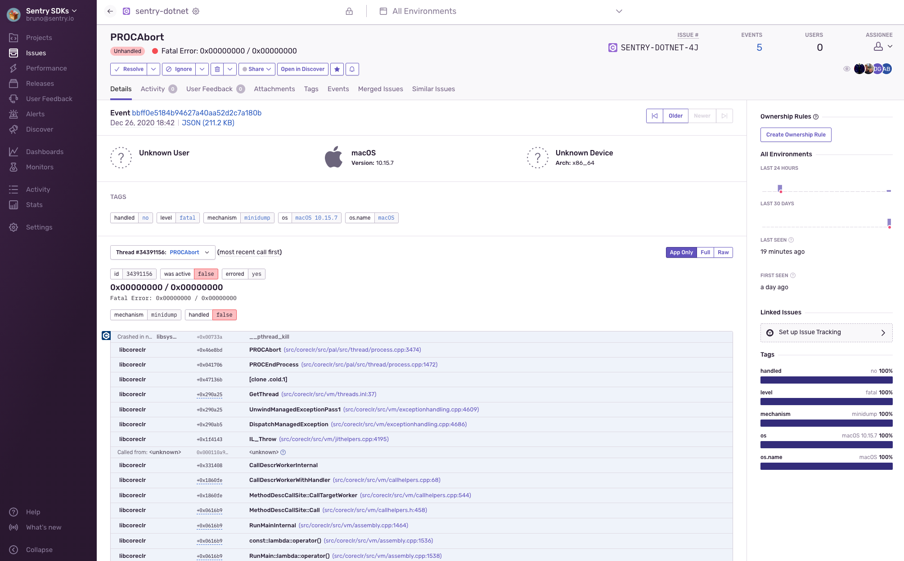

<p align="center">
  <a href="https://sentry.io" target="_blank" align="center">
    
  </a>
  <br />
</p>

Sentry Minidump SDK for .NET 
===========

[](https://www.nuget.org/packages/Sentry.Minidump) 

This is an experiment to bundle [`sentry-native`](https://github.com/getsentry/sentry-native) with [Google's crashpad](https://chromium.googlesource.com/crashpad/crashpad/) and distribute via NuGet with a .NET API to initialize.

Windows, macOS and Linux on x64 are the initial goals but we can add other platforms.

It allows capturing minidumps of .NET applications caused by native libraries or the .NET runtime itself.

At this time only .NET Standard 2.1 or .NET Framework 4.7 and higher are supoprted. This is due to  the current bindings generated by CppSharp. 
We can likely lower it to .NET Standard 2.0 if there's demand.  

If this is useful to you, help us in building this on [Discord, #dotnet](https://discord.gg/Ww9hbqr).



# Note On Platform Requirement

This package bundles an executable called `crashpad_handler` (or `crashpad_handler.exe` on Windows). This process creates a memory dump of your .NET process and uploads to Sentry. That means the executable needs to be deployed with your app, and needs `+x` access in order to get started (on macOS and Linux).

To test it, build the [sample](sample/Sentry.Minidump.Sample) project and start the executable from the bin folder:

> Set your own DSN on [Program.cs](sample/Sentry.Minidump.Sample/Program.cs) first so the test event goes to **yours Sentry dashboard**.

```
cd sample/Sentry.Minidump.Sample
dotnet build -c Release -r osx-x64

cd bin/Release/net5.0/osx-x64

# On macOS and Linux
chmod +x crashpad_handler

dotnet Sentry.Minidump.Sample.dll
```

Example:
```
➜  osx-x64 git:(main) ✗ dotnet Sentry.Minidump.Sample.dll
[sentry] INFO using database path "/Users/bruno/git/sentry-dotnet-native/sample/Sentry.Minidump.Sample/bin/Release/net5.0/osx-x64/.sentry-native"
[sentry] DEBUG starting backend
[sentry] DEBUG starting crashpad backend with handler "/Users/bruno/git/sentry-dotnet-native/sample/Sentry.Minidump.Sample/bin/Release/net5.0/osx-x64/crashpad_handler"
[sentry] DEBUG using minidump url "http://sentry.garcia.in:80/api/5428537/minidump/?sentry_client=sentry.native/0.4.4&sentry_key=80aed643f81249d4bed3e30687b310ab"
[sentry] INFO started crashpad client handler
Unhandled exception. System.AccessViolationException: Attempted to read or write protected memory. This is often an indication that other memory is corrupt.
   at System.Runtime.InteropServices.Marshal.ReadInt32(IntPtr ptr, Int32 ofs)
   at System.Runtime.InteropServices.Marshal.ReadInt32(IntPtr ptr)
   at Sentry.Minidump.Sample.Program.Main(String[] args) in /Users/bruno/git/sentry-dotnet-native/sample/Sentry.Minidump.Sample/Program.cs:line 16
[69212:36013020:20201227,230059.285955:WARNING process_memory_mac.cc:93] mach_vm_read(0x7ffee9bf8000, 0x2000): (os/kern) invalid address (1)
[1]    69205 abort      dotnet Sentry.Minidump.Sample.dll
```

# Build from source

Requirements: 
* .NET 5 SDK
* Whatever is required to build sentry-native (depends on platform)
* Whatever is required to build CppSharp (depends on platform)

If you want to build all artifacts from source, the steps involved are:

## Init submodules

Run [setup.sh](setup.sh) on macOS or Linux or [setup.cmd](setup.cmd) on Windows
This will initialize all git submodules.

## Build native dependencies

Under [sentry-native](sentry-native):
Run [build.sh](sentry-native/build.sh) on macOS or Linux or [build.cmd](sentry-native/build.cmd).

This will build `sentry-native`, and copy the generated native library and the crashpad_handler to the relevant folder under [sentry-native/sentry-native-artifacts](sentry-native/sentry-native-artifacts). These are bundled in the NuGet package.

On Linux, make sure to install openssl lib, otherwise `crashpad` will fail to compile.
For example, on Ubuntu: `sudo apt-get install libssl-dev`

## Resources

* [](https://docs.sentry.io/platforms/dotnet/)
* [](https://forum.sentry.io/c/sdks)
* [](https://discord.gg/Ww9hbqr)
* [](http://stackoverflow.com/questions/tagged/sentry)
* [](https://twitter.com/intent/follow?screen_name=getsentry)